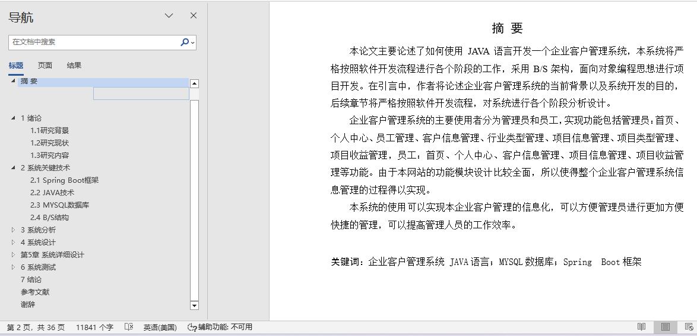
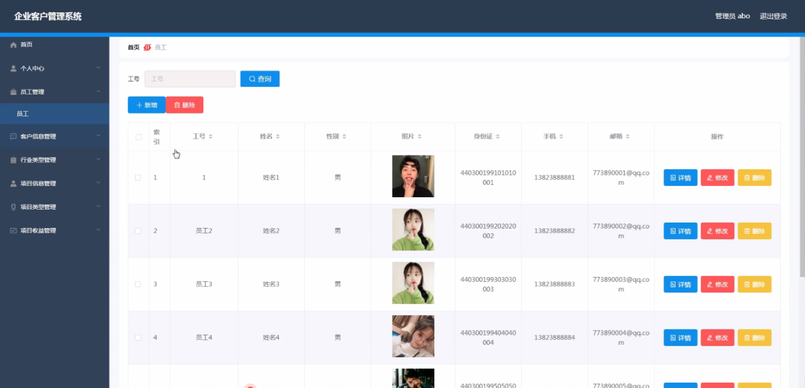
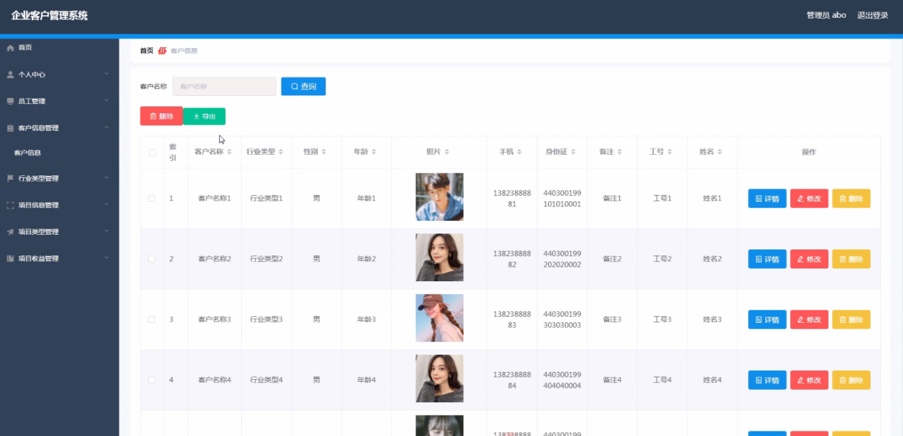
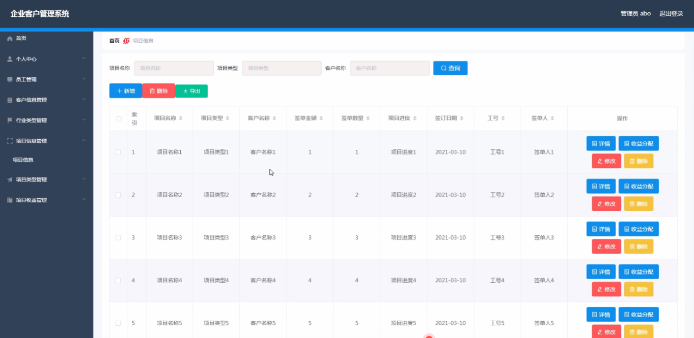
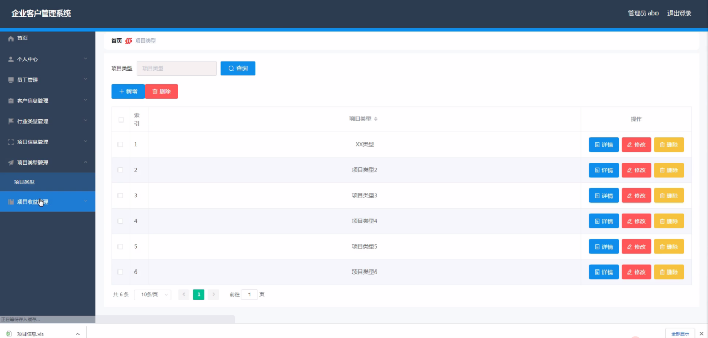
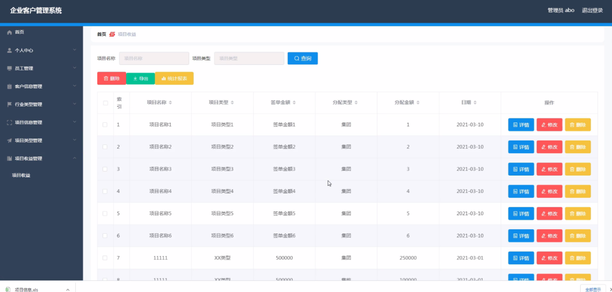
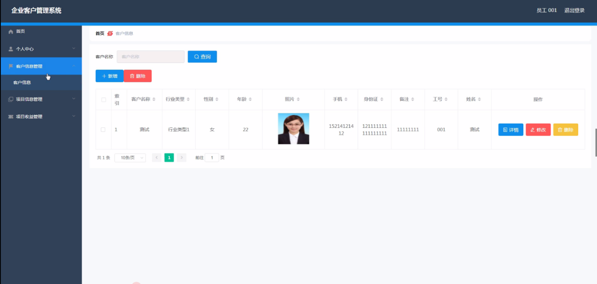
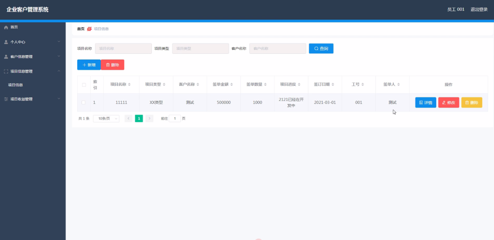

## 基于SpringBoot的企业客户管理系统(程序+报告)

- <b>完整代码获取地址：从戎源码网 ([https://armycodes.com/](https://armycodes.com/))</b>
- <b>技术探讨、资料分享，请加QQ群：692619798</b> 
- <b>作者微信：19941326836  QQ：952045282</b> 
- <b>承接计算机毕业设计、Java毕业设计、Python毕业设计、深度学习、机器学习</b>
- <b>选题+开题报告+任务书+程序定制+安装调试+论文+答辩ppt 一条龙服务</b>
- <b>所有选题地址 ([https://github.com/YuLin-Coder/AllProjectCatalog](https://github.com/YuLin-Coder/AllProjectCatalog)) </b>
## 项目介绍
基于SpringBoot的企业客户管理系统，系统包含两种角色：用户、管理员，系统分为前台和后台两大模块，主要功能如下：

### 【管理员】:
管理员登录  
管理员通过填写用户名、密码和角色进行登录。

首页、个人中心  
管理员登录后可以查看系统首页和个人中心，管理个人信息。

员工管理  
在员工管理页面中，管理员可以填写员工工号、姓名、性别、照片、身份证、手机、邮箱等信息，并可以对员工信息进行详情查看、修改或删除操作。

客户信息管理  
在客户信息管理页面中，管理员可以填写客户名称、行业类型、性别、年龄、照片、手机、身份证、备注、工号、姓名等信息，并可以对客户信息进行详情查看、修改或删除操作。

行业类型管理  
在行业类型管理页面中，管理员可以填写和管理行业类型，并对现有行业类型进行修改或删除操作。

项目信息管理  
在项目信息管理页面中，管理员可以填写项目名称、项目类型、客户名称、签单金额、签单数量、项目进度、签订日期、工号、签单人等内容，并对项目进行详情查看、收益分配、修改或删除操作。

项目类型管理  
在项目类型管理页面中，管理员可以填写和管理项目类型，并对现有项目类型进行修改或删除操作。

项目收益管理  
在项目收益管理页面中，管理员可以填写项目名称、项目类型、签单金额、分配类型、分配金额、日期等内容，并对项目收益进行详情查看、修改或删除操作。

### 【员工】:
员工登录  
员工通过填写工号、姓名、性别、照片、身份证、手机、邮箱等信息进行注册，登录后可以查看首页、个人中心、客户信息管理、项目信息管理、项目收益管理等内容。

个人信息  
员工可以在个人信息页面查看和修改个人信息，包括工号、姓名、性别、照片、身份证、手机、邮箱等内容。

客户信息管理  
员工可以在客户信息管理页面中填写客户名称、行业类型、性别、年龄、照片、手机、身份证、备注、工号、姓名等信息，并对客户信息进行详情查看、修改或删除操作。

项目信息管理  
员工可以在项目信息管理页面中填写项目名称、项目类型、客户名称、签单金额、签单数量、项目进度、签订日期、工号、签单人等信息，并对项目进行详情查看、修改或删除操作。

## 项目技术
- 编程语言：Java
- 数据库：MySQL
- 项目管理工具：Maven
- 前端技术：HTML、CSS、JavaScript、Jquery、Vue
- 后端技术：Spring、SpringMVC、MyBatis

## 运行环境
- JDK版本：JDK1.8及以上
- 开发工具：IDEA、Ecplise、Myecplise都可以
- 数据库: MySQL5.7及以上
- Maven：maven3.0及以上
- Node：14.14.0及以上

## 运行截图

